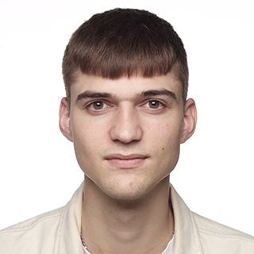

 Curriculum vitae
# `Ditlev Frickmann`

    
    
     Copenhagen N, Denmark
    &nbsp;&nbsp;
    
    
     reimer.frickmann@gmail.com
    &nbsp;&nbsp;
    
    
     +4523219859
    &nbsp;&nbsp;
    
    
    <a href="https://www.linkedin.com/in/ditlev-frickmann/" >Ditlev Frickmann </a>

# Profile

- 25 years old.
- Dedicated programmer and astrophysicist specialising in test automation, continous delivery and data processing pipelines.  
- Test Automation Engineer at Phase One.
- Soon to be M.Sc.Phys. at the University of Copenhagen.
- B.Sc.Eng. at the Technical University of Denmark
- Outgoing with a flair for teamwork and communication.
- Passionate about sustainability.
- Avid space geek.

# Overview
- [Education](Education/)
    - [Bachelor's Degree](Education/B.Sc.Eng.md)
    - [Master's Degree](Education/M.Sc.Phys.md)
- [Work Experience](WorkExperience/)
    - [Test Automation Engineer at Phase One](WorkExperience/TestAutomation-PhaseOne.md)
    - [Trainee at the European Space Agency](WorkExperience/Trainee-EuropeanSpaceAgency.md)
    - [And a handfull of others](WorkExperience/Others.md)
- [Skills](Skills/)
    - [Everything python](Skills/python.py)
    - [Continous delivery with Jenkins, Groovy, Docker and Git](Skills/Jenkinsfile.groovy)
    - [SDK test automation in C++](Skills/cpp.cpp)
    - [SDK test automation in C#](Skills/cs.cs)
- [References](References/references.md)