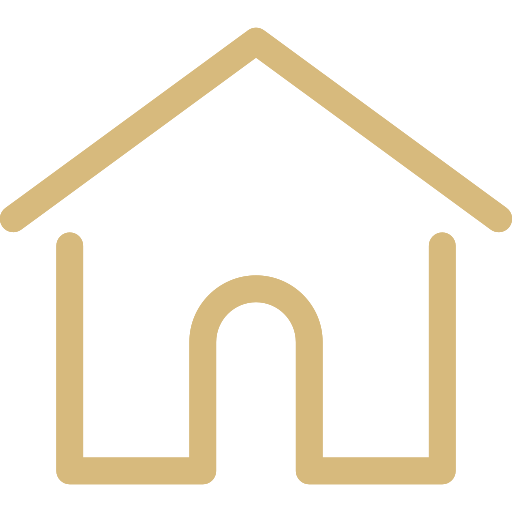

# Other Work Experience

## `Communicator of Natural Sciences`

    
    
     October 2018
    &nbsp;&nbsp;
    
    
     December 2020 
    &nbsp;&nbsp;
    
    
     Energi & Vand

I tought school children from the greater Copenhagen area in different topics falling within the natural sciences. The courses at Energi & Vand were rooted in reality, since the purpose was to give the students the tools to participate in debates concerning environmental and social sustainability. At Energi & Vand I redefined my passion for green technology and sustainability, and I grew to make personal choices to be more environmentally sustainable.

## `Communicator of Astrophysics`

    
    
     July 2019
    &nbsp;&nbsp;
    
    
     December 2020 
    &nbsp;&nbsp;
    
    
     Tycho Brahe Planetarium

At the Tycho Brahe Planetarium in Copenhagen I worked as a part time communicator, conveying their astrophysical content to a broad and varied crowd.

## `Volunteer Envoy`

    
    
     February 2017
    &nbsp;&nbsp;
    
    
     June 2017
    &nbsp;&nbsp;
    
    
     Mellemfolkeligt Samvirke

With Mellemfolkeligt Samvirke I've was abroad as a volunteer envoy in the first half of 2017. I also participated in courses about conflict management and facilitation of the social room.